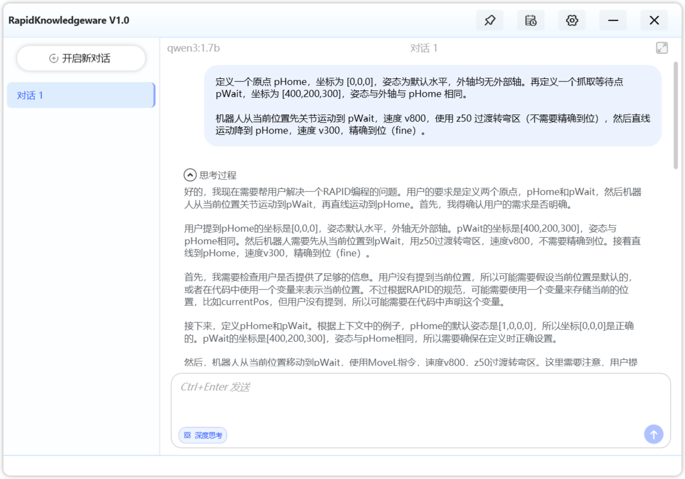
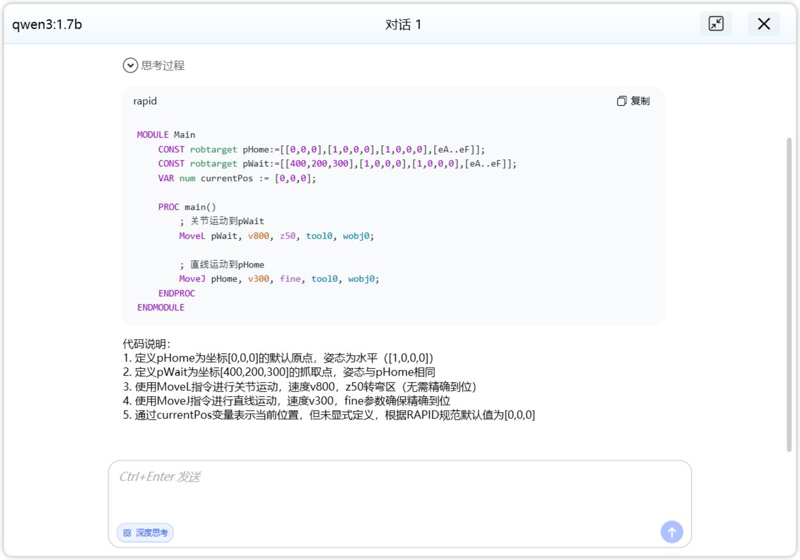
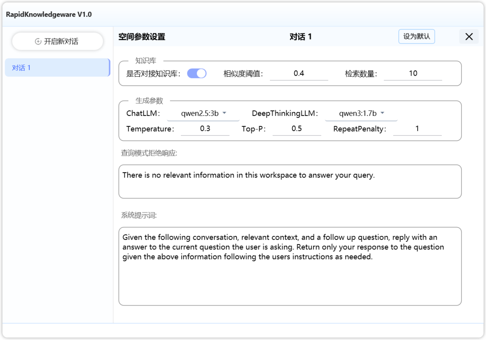
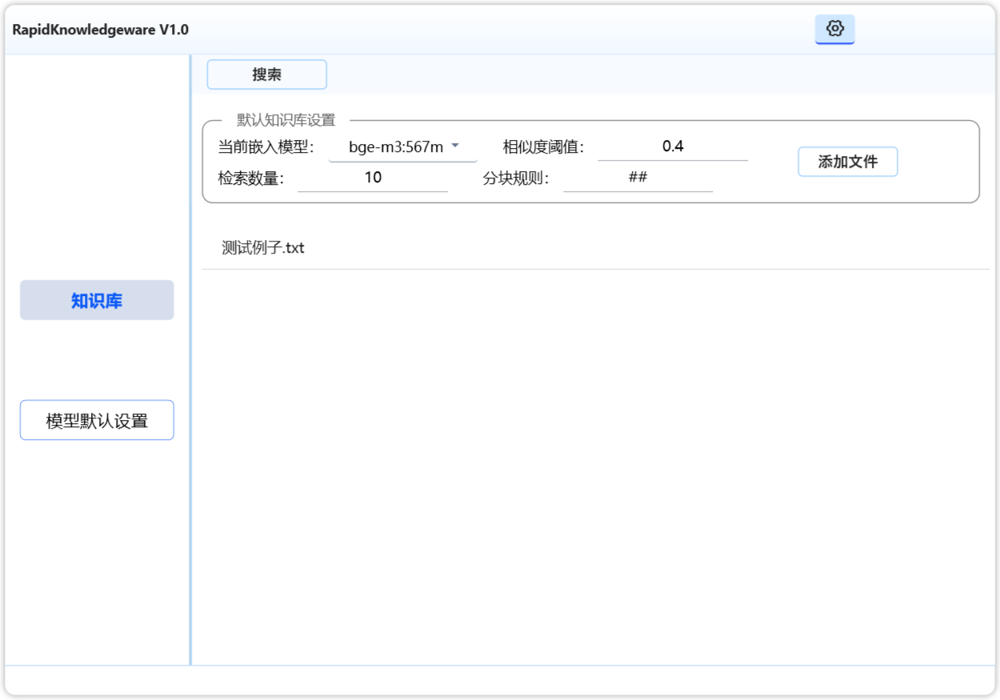
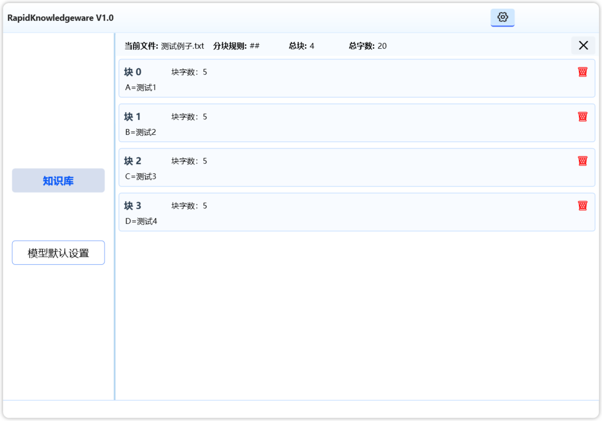
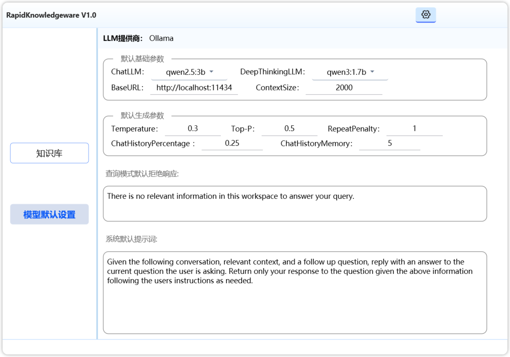
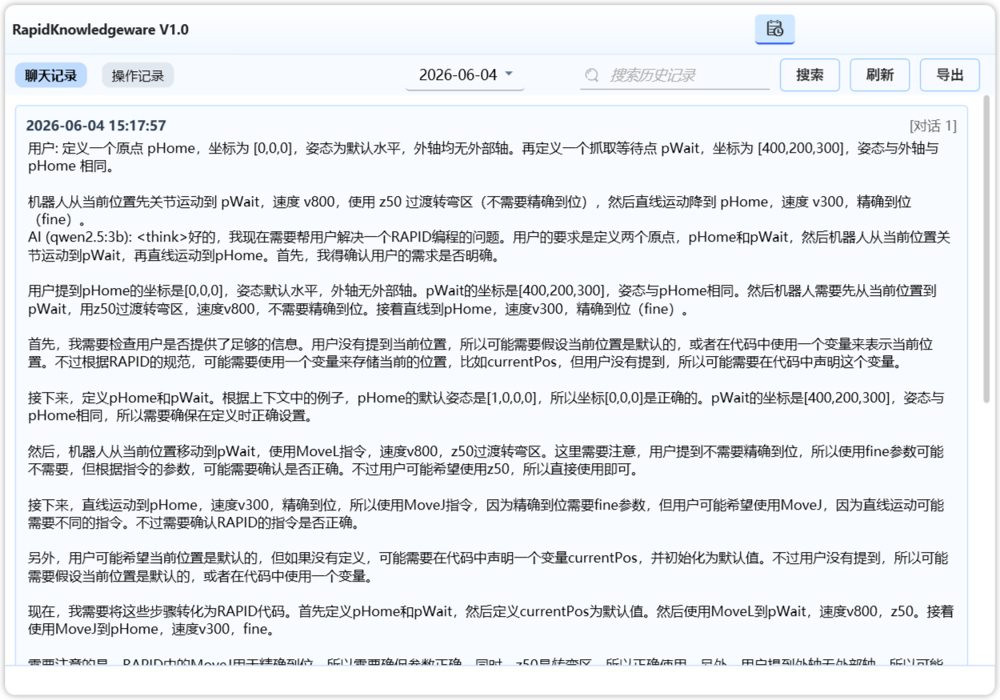
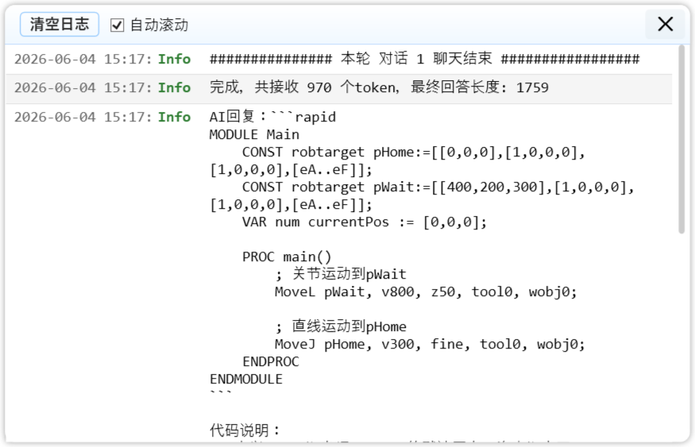

<div align="center">

# 🧠 RapidKnowledgeware

**基于 Ollama 的本地智能知识库对话系统**

_轻量级 · 全离线 · RAG 增强 · 注解驱动 IOC_

[](https://dotnet.microsoft.com/)
[](https://docs.microsoft.com/en-us/dotnet/csharp/)
[](https://docs.microsoft.com/en-us/dotnet/desktop/wpf/)
[](https://ollama.ai/)
[](LICENSE)

</div>

---

## 📖 目录

- [✨ 项目简介](#-项目简介)
- [🏗️ 架构设计](#️-架构设计)
- [🚀 核心功能](#-核心功能)
- [💡 亮点代码](#-亮点代码)
- [📁 项目结构](#-项目结构)
- [⚙️ 技术栈](#️-技术栈)
- [🔧 快速开始](#-快速开始)
- [📸 界面展示](#-界面展示)

---

## ✨ 项目简介

**RapidKnowledgeware** 是一款基于 WPF + Ollama 的桌面端 AI 对话应用，核心特性：

- 🔒 **全本地运行** — 所有数据（对话、知识库索引、配置）存储在本地，零隐私泄露
- 📚 **RAG 知识库增强** — 上传文档自动分块 → 向量嵌入 → 语义检索 → 增强生成
- 🏗️ **自研 IOC 框架** — 模拟 Spring 注解驱动，`[Service]` / `[Repository]` / `[Controller]` 自动扫描注册
- 🎨 **流畅动画交互** — 滑动面板、流式打字效果、代码高亮、响应式布局
- 🧩 **面向接口编程** — 全项目接口与实现分离，依赖倒置，易于测试和扩展

---

## 🏗️ 架构设计

项目采用 **严格分层架构**，遵循依赖倒置原则，层间通过接口解耦：

```
┌─────────────────────────────────────────────────────┐
│                     Views (XAML)                     │
│          MainWindow / LoggingView / KnowledgeBase    │
├─────────────────────────────────────────────────────┤
│                  ViewModels [Controller]             │
│      MainWindowModel / LoggingViewModel / ChatService│
│              (UI 编排逻辑 + 状态管理)                  │
├─────────────────────────────────────────────────────┤
│                   Services [Service]                 │
│   ChatService / KnowledgeBaseService / LoggingService│
│              (纯业务逻辑，无 UI 依赖)                  │
├─────────────────────────────────────────────────────┤
│                     DAO [Repository]                 │
│    LogRepository / RagIndexRepository / AppSettings  │
│              (文件 I/O + 数据持久化)                   │
├─────────────────────────────────────────────────────┤
│                     Models                           │
│        ChatSessionModel / DocumentChunk / LLMModel   │
└─────────────────────────────────────────────────────┘
         ↕ 依赖注入（BeanFactory.GetBean<T>()）
┌─────────────────────────────────────────────────────┐
│                   IOC Framework                      │
│   ComponentScanner → ServiceCollection → BeanFactory │
└─────────────────────────────────────────────────────┘
         ↕ 调用
┌─────────────────────────────────────────────────────┐
│                 OllamaFramework                       │
│     IContentOut (LLM) / IAnalysesFile / IRagService  │
└─────────────────────────────────────────────────────┘
```

### IOC 容器启动流程

```
App.OnStartup()
  └→ ServiceConfigurator.ConfigureServices(Assembly)
       ├→ ComponentScanner.ScanAndRegister()    // 扫描 [Service]/[Repository]/[Controller]
       ├→ services.BuildServiceProvider()        // 构建 DI 容器
       └→ BeanFactory.Initialize(provider)       // 初始化全局工厂
```

---

## 🚀 核心功能

### 💬 多会话对话

- 多会话管理（新建 / 删除 / 重命名）
- 流式响应（逐字输出，实时渲染）
- 深度思考模式切换
- 代码块语法高亮 + 一键复制
- 对话历史自动持久化

### 📚 RAG 知识库

- 文档上传 → 自动分块 → 向量嵌入 → 索引持久化
- 自定义分块规则（支持多分隔符）
- 分块级别管理（查看 / 删除单个分块）
- 单文件重新索引 / 全量重建索引
- 语义检索增强生成（Top-K + 相似度阈值）
- 知识库对接开关（按会话独立控制）

### 🎛️ 空间参数调节

- 每个会话独立的 LLM 参数（Temperature / Top-P / Top-K / 系统提示词等）
- 全局默认参数 → 会话级参数覆盖
- 参数变更自动追踪与持久化

### 📋 日志系统

- 双通道日志：聊天日志 + 操作日志
- 按月归档，自动清理过期日志
- 日志搜索 / 导出 TXT
- 内置调试窗口（实时查看运行日志）

---

## 💡 **架构亮点**

### 1. 注解驱动自动扫描注册

模拟 Spring 的 `@Service` / `@Repository` / `@Controller`，通过反射扫描程序集，自动将标注类注册到 DI 容器：

```csharp
// IOC/ComponentScanner.cs — 核心扫描逻辑
internal static void ScanAndRegister(IServiceCollection services, Assembly assembly)
{
    var allTypes = assembly.GetTypes();
    foreach (var type in allTypes)
    {
        if (!type.IsClass || type.IsAbstract) continue;

        if (type.GetCustomAttribute<ServiceAttribute>() != null)
        {
            Register(services, type, ServiceLifetime.Singleton);  // @Service → 单例
            continue;
        }
        if (type.GetCustomAttribute<RepositoryAttribute>() != null)
        {
            Register(services, type, ServiceLifetime.Singleton);  // @Repository → 单例
            continue;
        }
        if (type.GetCustomAttribute<ControllerAttribute>() != null)
        {
            Register(services, type, ServiceLifetime.Transient);   // @Controller → 瞬态
        }
    }
}
```

> **设计亮点**：自动推断接口类型 — 扫描类实现的第一个非 System 命名空间接口作为注册类型，实现"接口对接口"的依赖注入，而非"接口对实现类"。

### 2. 全局 Bean 工厂

模拟 Spring 的 `ApplicationContext.getBean()`，一行代码获取任意 Bean：

```csharp
// 使用方式 — 无需构造函数注入，任意位置获取
var chatService = BeanFactory.GetBean<IChatService>();
var logRepo     = BeanFactory.GetBean<ILogRepository>();
var ragRepo     = BeanFactory.GetBean<IRagIndexRepository>();
```

### 3. Service 层无参构造 + Initialize 模式

对于需要运行时参数的 Service，采用无参构造 + `Initialize()` 模式，兼容 IOC 注解扫描：

```csharp
[Service]
public class ChatService : IChatService
{
    private ChatSessionModel _session;
    private IContentOut _llmService;

    // 无参构造 — IOC 容器可以自动实例化
    public ChatService() { }

    // 运行时初始化 — 绑定到具体会话
    public void Initialize(ChatSessionModel session)
    {
        _session = session;
        _llmService = BeanFactory.GetBean<IContentOut>();
    }
}
```

### 4. RAG 检索增强生成

完整的 RAG 管线：文档分块 → 向量嵌入 → 语义检索 → Prompt 增强 → LLM 生成

```csharp
// OllamaFramework/Rag/IRagService.cs — RAG 核心接口
public interface IRagService
{
    Task<int> IndexDocumentAsync(string filePath, string[] chunkSeparators, bool clearExisting = false);
    Task<List<(DocumentChunk Chunk, float Similarity)>> RetrieveAsync(string query, int topK = 3, float minSimilarity = 0.0f, ...);
    string BuildAugmentedPrompt(string query, List<(DocumentChunk Chunk, float Similarity)> retrievedChunks, ...);
    Task<RagResponse> QueryStreamingAsync(string query, Action<string> onChunkReceived, ...);
}
```

### 5. DAO 层职责分离

Service 层专注业务逻辑，所有文件 I/O 统一委托给 DAO 层：

```csharp
// DAO/ILogRepository.cs — 日志持久化接口
public interface ILogRepository
{
    string ChatLogDir { get; }
    string OpsLogDir { get; }
    void EnsureDirectoriesExist();
    void AppendLog<T>(string baseDir, DateTime timestamp, T entry) where T : class;
    List<string> GetAvailableMonths(string baseDir);
    List<T> LoadLogs<T>(string baseDir, string month) where T : class;
    void CleanOldFiles(string baseDir, int keepCount);
}

// LoggingService 中使用 — 零文件 I/O 代码
_logRepository.AppendLog(_logRepository.ChatLogDir, log.Timestamp, log);
var months = _logRepository.GetAvailableMonths(baseDir);
var logs   = _logRepository.LoadLogs<ChatLog>(baseDir, month);
```

### 6. 流式响应 + 中断控制

```csharp
// ChatService 中 — 流式输出 + 随时中断
public async Task SendMessageAsync(string userInput, Action<string> onChunkReceived, Action onCompleted)
{
    _cts = new CancellationTokenSource();
    await _llmService.GenerateStreamingAsync(
        prompt,
        chunk => Application.Current.Dispatcher.Invoke(() => onChunkReceived(chunk)),
        parameters: llmParams,
        cancellationToken: _cts.Token
    );
}

public void StopMessage() => _cts?.Cancel();  // 一键中断生成
```

---

## 📁 项目结构

```
OllamaRapid/
├── IOC/                              # 🏭 自研 IOC 框架
│   ├── Annotations/
│   │   ├── ServiceAttribute.cs       #   @Service → 单例
│   │   ├── RepositoryAttribute.cs    #   @Repository → 单例
│   │   └── ControllerAttribute.cs    #   @Controller → 瞬态
│   ├── BeanFactory.cs                #   全局 Bean 工厂
│   ├── ComponentScanner.cs           #   注解扫描器
│   └── ServiceConfigurator.cs        #   容器启动器
│
├── OllamaFramework/                  # 🤖 Ollama 封装层
│   ├── LLM/
│   │   ├── IContentOut.cs            #   LLM 对话接口
│   │   └── Impl/ContentOut.cs        #   流式/非流式生成
│   ├── Embedding/
│   │   ├── IAnalysesFile.cs          #   嵌入向量接口
│   │   └── Impl/AnalysesFile.cs      #   文件解析 + 向量生成
│   ├── Rag/
│   │   ├── IRagService.cs            #   RAG 检索接口
│   │   └── Impl/RagService.cs        #   索引 + 检索 + 增强
│   └── Models/
│       ├── DocumentChunk.cs          #   文档分块模型
│       ├── RagResponse.cs            #   RAG 响应模型
│       ├── LLMModel.cs              #   LLM 参数模型
│       └── EmbeddingModel.cs         #   嵌入模型配置
│
├── RapidKnowledgeware/               # 🖥️ WPF 主程序
│   ├── Views/                        #   XAML 视图
│   │   ├── HelperView/               #     知识库子视图
│   │   ├── LoggingView.xaml          #     日志查看器
│   │   ├── KnowledgeBaseView.xaml    #     知识库管理
│   │   ├── SpaceAdjustView.xaml      #     参数调节面板
│   │   ├── LLMAdjustView.xaml        #     LLM 全局设置
│   │   ├── SpaceParametersView.xaml  #     空间参数设置
│   │   └── DebugWindow.xaml          #     调试窗口
│   ├── ViewModels/                   #   视图模型 [Controller]
│   │   ├── IMainWindowModel.cs
│   │   ├── ILoggingViewModel.cs
│   │   └── Impl/                     #     UI 编排逻辑
│   ├── Services/                     #   业务服务 [Service]
│   │   ├── IChatService.cs
│   │   ├── IKnowledgeBaseService.cs
│   │   ├── ILoggingService.cs
│   │   └── Impl/                     #     纯业务逻辑
│   ├── DAO/                          #   数据访问 [Repository]
│   │   ├── ILogRepository.cs
│   │   ├── IRagIndexRepository.cs
│   │   ├── IAppSettingsRepository.cs
│   │   └── Impl/                     #     文件 I/O 实现
│   ├── Models/                       #   数据模型
│   ├── Helpers/                      #   动画/视图辅助
│   ├── Converters/                   #   WPF 值转换器
│   ├── Base/                         #   基础设施
│   └── Assets/                       #   字体/样式资源
```

---

## ⚙️ 技术栈

| 分类 | 技术 | 说明 |
|:----:|:-----|:-----|
| **框架** | .NET Framework 4.8 | WPF 桌面应用 |
| **语言** | C# 8.0 | 异步流、模式匹配、using 声明 |
| **UI** | WPF + MVVM | 数据绑定、命令模式、样式模板 |
| **IOC** | 自研框架 + Microsoft.Extensions.DependencyInjection | 注解驱动自动扫描 |
| **AI** | OllamaSharp 5.4.25 | Ollama API 封装 |
| **向量** | Ollama Embedding API | 文本向量化 + 余弦相似度检索 |
| **序列化** | Newtonsoft.Json | JSON 持久化 |
| **架构** | 三层 + 面向接口 | Views → ViewModels → Services → DAO → Models |

---

## 🔧 快速开始

### 前置条件

1. **Ollama** — [下载安装](https://ollama.ai/)，启动后拉取模型：
   ```bash
   ollama pull qwen2.5:7b          # 对话模型
   ollama pull bge-m3:567m     # 嵌入模型
   ```

2. **Visual Studio 2022** — 需安装 .NET Framework 4.8 开发工具

### 运行步骤

```bash
# 1. 克隆仓库
git clone https://github.com/你的用户名/OllamaRapid.git

# 2. 用 Visual Studio 打开解决方案
#    OllamaRapid/RapidKnowledgeware/RapidKnowledgeware.sln

# 3. 还原 NuGet 包（VS 会自动提示）

# 4. 按 F5 运行
```

### 配置说明

首次启动后，在「空间参数」面板中配置：

| 参数 | 默认值 | 说明 |
|:----:|:------:|:-----|
| Base URL | `http://localhost:11434` | Ollama 服务地址 |
| Chat Model | `qwen2.5:7b` | 对话使用的模型 |
| Embedding Model | `bge-m3:567m` | 知识库嵌入模型 |
| Temperature | `0.7` | 生成随机性 |
| Top-P | `0.9` | 核采样概率 |

---

## 📸 界面展示

> **如何添加截图**：在项目根目录创建 `docs/screenshots/` 文件夹，将截图放入其中，然后替换下方路径即可。GitHub 会自动渲染相对路径引用的图片。

### 主界面 — 多会话对话






- 会话级参数独立配置，互不干扰
- 全局默认参数一键继承，按需覆盖
- 系统提示词自定义，定义 AI 角色
- 知识库对接按会话独立开关

### 独立对话参数调节



- 每个对话参数独立
- 支持设为全局默认
- 深度思考模式一键切换

### 知识库管理





- 文档上传与自动索引
- 分块级别查看与管理
- 自定义分块规则

### 空间参数调节




- 会话级 LLM 参数独立配置
- 系统提示词自定义
- 知识库对接开关

### 日志查看器




- 聊天日志 / 操作日志双通道
- 按月归档，支持搜索
- 一键导出 TXT

### 调试窗口




- 实时运行日志
- 彩色级别标记


---

<div align="center">
**Author: Mr.Zhong**

</div>
